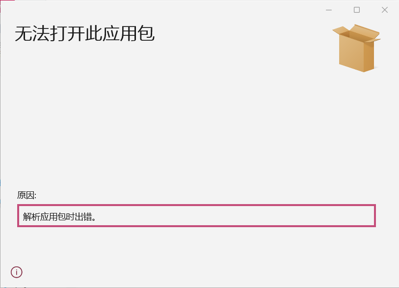
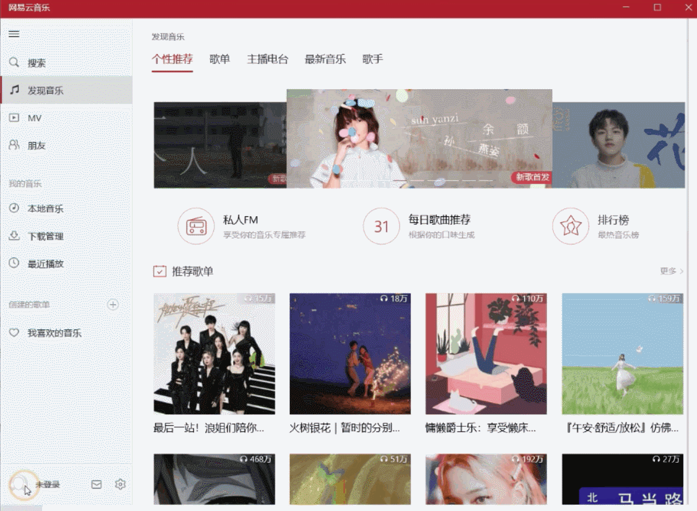
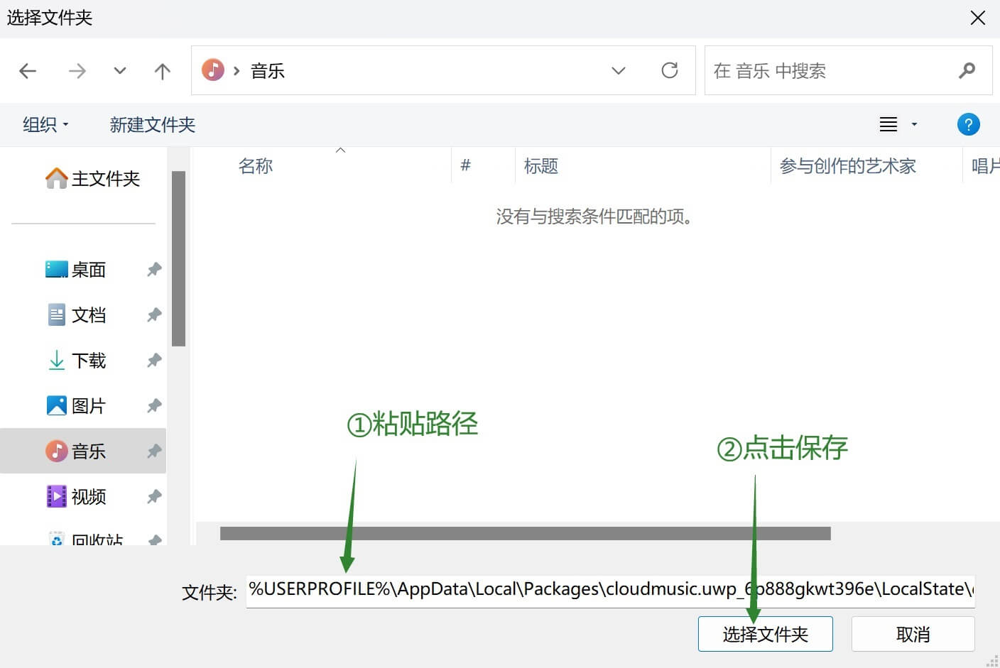

### &nbsp;

# 🎼 CloudMusic.UWP-Repacked 🚀

&nbsp;

## 简介

经典的 **网易云音乐 UWP** 重打包版客户端，不会自动更新，且可以与官方版共存。

- 整合了原版的 100 及 400 尺寸图形资源，其他修改版普遍残缺
- 完全解决在 Windows 11 系统下的文件访问权限问题，可以下载保存到任意位置
- 只对原版软件进行了简单地重新打包以避免自动更新，未修改或增加任何程序代码，请放心使用

> [!IMPORTANT]
> 本软件**不提供**任何 VIP 音源破解等服务，您需要在对应平台取得相应会员身份才能进行播放。<br />
> 所有内容资源 _（包括但不限于音频、图片等）_ 版权归网易云音乐所有。<br />
> 本软件仅学习交流使用，请勿用于商业用途。如有侵权，请发 Issue 提出。<br />
> 使用此应用即代表您同意 [网易云音乐服务条款](https://st.music.163.com/official-terms/service) 以及 [网易云音乐隐私政策](https://st.music.163.com/official-terms/privacy)。

&nbsp;

## 下载

**点击下载：**<br />
&nbsp;&nbsp;[1.3.3](./Cloud.Music.UWP.Repacked-1.3.3.0_universal.appxbundle)
&nbsp;&nbsp;[1.4.1](./Cloud.Music.UWP.Repacked-1.4.1.0_universal.appxbundle)

**最近更新：**<br />
已重新制作，尽可能地还原了原包的特征。不确定是否能解决 Win 11 偶尔显示异常的问题。~~如果还无效就没办法了。~~

> [!NOTE]
> 1.4.1 应该是最后一个正宗的 UWP 版本，理论上缺陷最少；支持下载和播放 NCM 私有格式。<br />
> 1.3.3 是更早的一个版本，和 1.4.1 差别不大；但不能下载为 NCM 格式，也不支持播放现有 NCM。<br />
> 您可以按需选择其中一个版本下载体验。

> [!TIP]
> 通用版安装包已经包含了所有平台 _（x86/x64/arm）_ 的安装所需文件，因此体积较大 _（≈44MB）_<br />
> 安装过程中系统会自动选择并安装，最终程序体积约为 36MB，远小于现有 Win32 版本，当然更轻量

&nbsp;

## 特别说明

UWP 版本停更已久，实话实说，现在小毛病已经出现了不少。目前只算还勉强能用，尤其适合低性能设备以及偶尔才使用网易云的用户。<br />
现在能用，纯粹是因为网易还没把这套旧API彻底掐死。哪天后端一改、风控一升级，UWP 版说死就死，没有任何人能修复。<br />
实测在2026年7月，客户端还能正常登录，播放音乐。<br />
天下没有不散的宴席，且用且珍惜吧。

&nbsp;

## 安装

由于 Windows 只允许安装来自**微软商店**或者**企业开发者**的 appx/msix&bundle 软件包，<br />
所以我们需要先安装**自签名证书**来伪装成企业开发者，才能安装第三方软件包。

请选择以下其中一种方法：

### 方法一：手动安装证书（推荐）

> 此方法完全手动操作，不涉及任何第三方工具，不会被杀毒软件误报。

1. 下载 [证书文件](./tools/ca.cer) 与合适的 appx&bundle 软件包。
2. 右键点击 `ca.cer` 证书文件，选择「安装证书」。
3. 选择「本地计算机」，下一步（需要管理员权限）。
4. 选择「将所有的证书都放入下列存储」，点击「浏览」，选择「受信任的根证书颁发机构」，确定，一路点击「下一步」，继续完成证书导入。
5. 在开始菜单中找到 PowerShell，以**管理员身份**运行，执行以下命令安装 appx&bundle 软件包：

   ```
   Add-AppxPackage <路径>
   ```

   其中 `<路径>` 是您下载的 appx&bundle 文件的完整路径。`Add-AppxPackage` 不严格要求大小写。

6. 打开软件。如有问题，请查阅下方的 [已知问题及解决方法](#已知问题及解决方法)。

### 方法二：一键安装证书

1. 下载 [证书安装脚本](./tools/一键安装根证书.bat) 与 [证书文件](./tools/ca.cer)，以及合适的 appx&bundle 软件包。
2. 右键或长按选择以管理员身份打开 `一键安装根证书.bat`，根据提示操作即可。
3. 当显示内容包含 `证书 "MyCA Root" 添加到存储` 或者 `证书 "MyCA Root" 已经在存储中` 说明安装成功。
4. 在开始菜单中找到 PowerShell，以**管理员身份**运行，执行以下命令安装 appx&bundle 软件包：

   ```
   Add-AppxPackage <路径>
   ```

   其中 `<路径>` 是您下载的 appx&bundle 文件的完整路径。`Add-AppxPackage` 不严格要求大小写。

5. 打开软件。如有问题，请查阅下方的 [已知问题及解决方法](#已知问题及解决方法)。

> [!NOTE]
> 某些杀毒软件可能会将证书安装工具误报为病毒，<br />
> 您可能需要暂时关闭杀毒软件或者添加白名单才能使用。<br />
> **因此建议优先使用方法一进行手动安装。**<br />
> *本项目及配套工具不包含任何病毒及无关修改，欢迎找茬。*

&nbsp;

## 已知问题及解决方法

### 1. 安装 appx&bundle 时「无法安装相关项」与「解析应用包时出错」

通常情况下，Windows 的「应用安装程序」会自动下载并补全缺失的依赖软件包。<br />
但在少数系统环境中，亦或与微软服务器的网络连接不太顺畅时，安装时还是会提示「无法安装相关项」。

1. 打开 dependencies 文件夹，根据您的系统架构选择对应的文件夹。
2. 右击打开文件夹，在开始菜单中搜索 PowerShell 并打开它，在里面挨个输入 `Add-AppxPackage <路径>` 安装依赖包。`Add-AppxPackage` 不严格要求大小写。

&nbsp;

### 2. 提示网络错误无法登录



1. 点击左下角「未登录」头像 → 关于网易云音乐，来到关于界面
2. 对界面右上角的网易云音乐 Logo 左键连点 6 下，然后迅速右键单击，会弹出调试对话框（如果不行就多试几次）
3. 将服务地址 `http://music.163.com` 中的 `http` 改为 `https`，即改为 `https://music.163.com`，然后确认
4. 手动重启应用后即可正常登录

> [!TIP]
> 详情请参见 [b 站专栏文章](https://www.bilibili.com/read/cv9556360/)

#### 提示存在风险无法登录

1. 如果您使用了任何抓包/网络过滤/加速器/代理软件，请将它们关闭后再试
2. 使用同一台电脑先登录[网页版](https://music.163.com)，成功之后再尝试登录 UWP
3. 参照上述方法改为 HTTPS 后使用 QQ 扫码登录

#### 提示「不可信设备」

1. 在手机端登录账号
2. 进入设置关闭登录保护
3. 正常登录 UWP 客户端
4. 如有必要，在 UWP 登录成功后可重新打开保护。

&nbsp;

### 3. 下载时文件存储失败

在 22H2 及更高版本的 Windows 11 中下载音乐时提示文件存储失败。

请选择以下其中一种解决方法：

#### 方法一（完美解决）

> 实现原理：修改特定文件夹权限，使其可被软件访问

1. 下载 [路径授权工具](./tools/授权访问外部路径.exe)
2. 如果安全软件提示有风险，可能需要点击忽略或加入白名单
3. 右键以管理员身份运行
   - 选择「是」将授权默认的下载目录（用户文件夹 > 音乐）
   - 选择「否」可以选择其他路径进行授权（需要手动在软件内同步修改下载路径）
4. 如果工具无法正常运行：
   - 请检查是否被安全软件意外拦截了
   - 如果提示缺失 xxx.dll，请先根据架构安装 [VC++ 运行库 x86](https://aka.ms/vs/17/release/vc_redist.x86.exe) [VC++ 运行库 x64](https://aka.ms/vs/17/release/vc_redist.x64.exe)

> [!WARNING]
> 授权自定义目录时，请尽可能减小授权范围到专用的文件夹，<br />
> 尽量避免授权无关路径，尤其是不要授权整个磁盘或者 `%USERPROFILE%` 路径！<br />
> 假设您想使用 **D:\个人\音乐\CloudMusic** 作为下载路径，<br />
> 那么只需要授权 **CloudMusic** 这个文件夹即可；<br />
> 需慎重选用 **~~D:\个人\音乐~~**，务必注意不要随意授权 **~~D:\个人~~** 甚至 **~~D:&#92;~~**

#### 方法二（相对保守）

> 实现原理：请参见 [issue](https://github.com/JasonWei512/NetEase-Cloud-Music-UWP-Repack/issues/24)

1. 下载 [路径创建工具](./tools/创建内部下载路径.vbs)
2. 双击运行 `创建内部下载路径.vbs`<br />
   如果提示权限不足，请关闭云音乐软件后再次运行此脚本（通常不需要管理员权限），如果还是不行就可以尝试以管理员身份运行。
3. 打开云音乐 UWP，参照图片，将下载路径设置为<br />
   `%USERPROFILE%\AppData\Local\Packages\1F8B0F94.122165AE053F_yc15719j0dst8\LocalState\download\music`
4. 重新登录后测试是否可以正常下载音乐。<br />
   如果可以，那么，请不要再改动程序设置中的下载路径，以免失效。

&nbsp;

### 4. 我是黑胶会员，但播放/下载时显示需要开通

手动退出登录，然后重新登录账号，即可恢复正常。<br />
如果仍然无效，或许就需要去看看您的黑胶会员是不是真的过期了。

&nbsp;

### 5. 因「安全原因」被要求修改密码

网易云近期大力打击第三方播放器，目前建议不要在无官方授权的音乐软件中登录网易云音乐账号。<br />
网易云如果第三方播放器已成功登录能正常用就正常用，不要随意登出账号，否则再也登录不了了。<br />
每次触发风控都会被要求修改密码，如果频繁触发风控还会导致短期封号。<br />

&nbsp;

### 6. Windows on ARM 更新 24H2+ 后无法安装和使用

此问题只影响了非常罕见的 ARM64 电脑用户。普通的 x86/x64 设备不受影响。<br />
当初 UWP 客户端只提供了 32 位的 ARM 版本，是为 Windows Phone 手机准备的。后来采用高通骁龙/苹果 M 处理器的电脑也算搭了个便车。<br />
但是，微软在 Windows 11 24H2 更新中移除了对 32 位 ARM 的 UWP 应用支持，导致新版系统已经无法安装。<br />
~~微软官方给出的解决方案是重新编译为 ARM64，但停止维护的非开源软件能编译个屁。~~ 此问题根本无法解决。<br />
如果需要在 ARM64 设备上使用，可以考虑用提供了全架构版本的第三方客户端替代，例如 [HyPlayer](https://github.com/HyPlayer/HyPlayer)。

&nbsp;

### 7. 不支持 HiRes 和超清母带等新音质

UWP 客户端推出时还没这些~~提升用户体验的~~音质级别，停止更新后自然没有跟进。<br />
如果需要在 UWP 平台/设备播放这些音质的音频，请考虑用[网易云音乐新网页版](https://music.163.com/st/webplayer)，或第三方客户端替代，比如 [HyPlayer](https://github.com/HyPlayer/HyPlayer)。~~记得打钱~~

&nbsp;

## 特别鸣谢

### [网易云音乐](https://music.163.com/)
毫无疑问地得排在第一位。

### [JasonWei512/NetEase-Cloud-Music-UWP-Repack](https://github.com/JasonWei512/NetEase-Cloud-Music-UWP-Repack)
为本项目提供了灵感，以及部分常见问题的解决方法。

### [kenvix/NeteaseMusicUWP](https://github.com/kenvix/NeteaseMusicUWP)
提供了原版软件包。

### [Microsoft Developer](https://developer.microsoft.com/zh-cn/)
提供了编辑 appx/msix&bundle 所需的工具和参考资料。